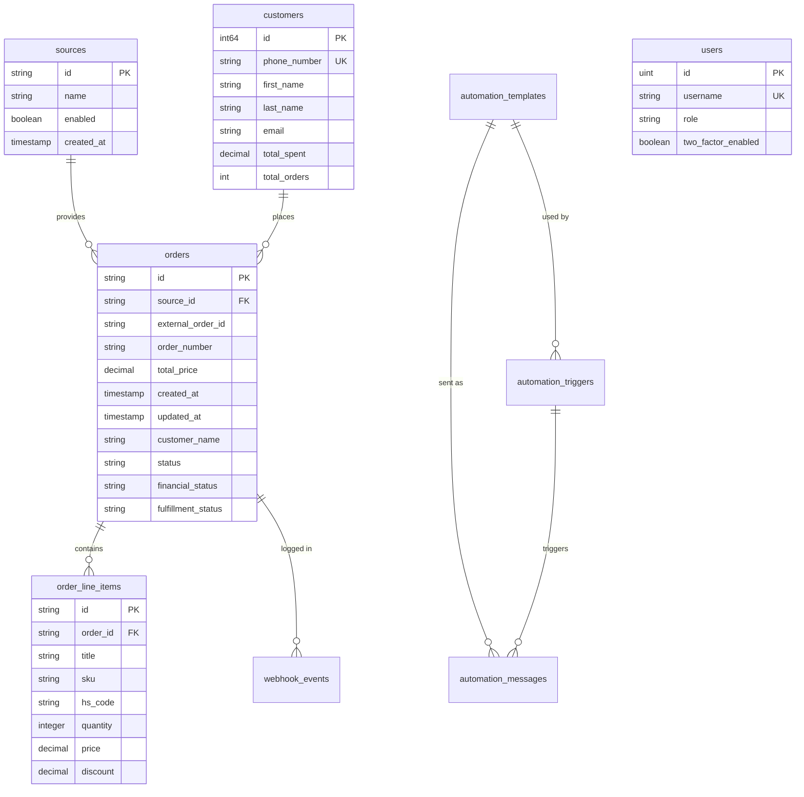

# Database Schema Reference

This document provides a detailed reference for the PostgreSQL database schema used by the GST Invoice Manager.

## 📊 Entity Relationship Diagram

## 🗄️ Core Tables

### `orders`
Primary storage for transaction data.
- `id`: Internal UUID/String identifier.
- `external_order_id`: ID from the source platform (e.g., Shopify ID).
- `order_number`: Human-readable number (e.g., #1001).
- `status`: Internal workflow status.

### `order_line_items`
Individual items within an order.
- `hs_code`: Harmonized System code used for GST calculation.
- `order_discount`: Proportionate discount applied to this item from order-level discounts.

### `customers`
Aggregated customer profiles.
- Identifies customers primarily by `phone_number` for WhatsApp continuity.

### `automation_templates`
WhatsApp message templates approved by Meta.
- `body`: The message text with `{{n}}` placeholders.
- `variable_mappings`: JSON mapping placeholders to order/customer fields.

### `app_configs`
Centralized encrypted storage for API keys and environment-specific settings.

---
> [!NOTE]
> Schema is derived from `backend/internal/database/migrations` and verified against GORM tags in `backend/internal/entity`.
