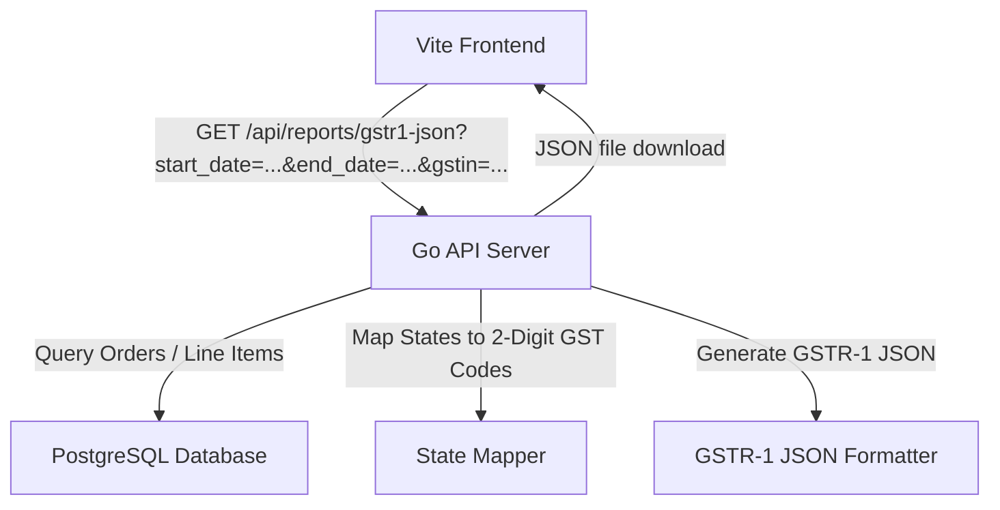

# Workflow: GSTR-1 Offline JSON Export

This document details the GSTR-1 offline utility JSON generation and export flow within the Mi-Tech GST Invoice Manager. The generated JSON file can be uploaded directly to the Indian government GST Portal.

## 🧭 Architecture

The GSTR-1 export compiles B2C Small consolidated sales (Table 7), HSN summaries (Table 12), and outbound document sequences (Table 13) for a given date range.

## 🛠 Compilation Rules

### 1. Root-Level Metadata
* **`gstin`**: The user-selected/configured Business GSTIN.
* **`fp`**: The filing period formatted as `MMYYYY` (e.g. `062026` for June 2026), derived from the end date.
* **`version`**: Compliant version identifier (`v1.0`).

### 2. B2CS (B2C Small — Table 7)
Consolidated sales to unregistered customers are aggregated by customer state (POS) and tax rate:
* **Place of Supply (`pos`)**: Customer state names are mapped to official 2-digit GST state codes (e.g. Tamil Nadu $\rightarrow$ `33`, Karnataka $\rightarrow$ `29`).
* **Supply Type (`sply_ty`)**:
  * `INTRA` for Tamil Nadu sales (split into 50% CGST + 50% SGST).
  * `INTER` for all other states (assigned 100% IGST).
* **Operator Type (`typ`)**:
  * `E` (E-Commerce) for Amazon sales.
  * `OE` (Other than E-Commerce) for Shopify sales.

### 3. HSN Summary (Table 12)
Consolidated outward supply summaries grouped by HSN code:
* **Default HSN**: `33029019` (Perfumes/Essential Oils) is applied if no HS Code is found.
* **Quantity & Value**: Quantities and prices are aggregated per HSN.
* **Taxes**: IGST, CGST, and SGST are computed proportionally for line items and rounded to 2 decimal places.
* **UQC**: Standard unit quantity code set to `PCS` (Pieces).

### 4. Documents Issued (Table 13)
Sequential document ranges issued during the filing period:
* **Shopify Range**: Document serial numbers prefixed with `SY-` (e.g., `SY-2853` to `SY-2855`).
* **Amazon Range**: Document serial numbers prefixed with `AMZ-` (e.g., `AMZ-1` to `AMZ-10`).
* **Attributes**: Outputs total document count, cancelled count, and net issued count per series.

---

> [!IMPORTANT]
> The exported file is named `GSTR1_[GSTIN]_[MMYYYY].json` and is compatible with the GSTR-1 Offline Tool.
