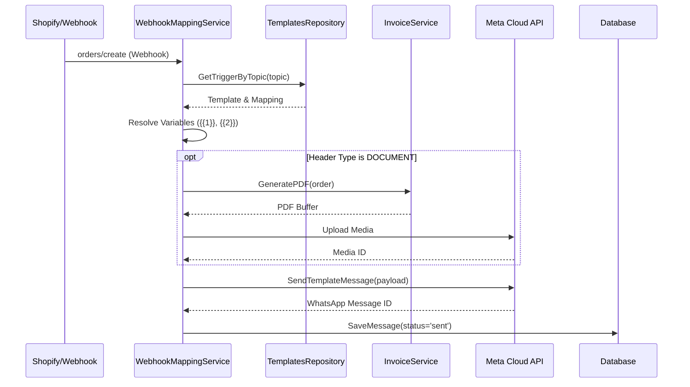

This document details the technical lifecycle of an automated WhatsApp message, from initial trigger to delivery tracking.

## 🔄 Logic flow (Automation Loop)

## 🧩 Key Components

### 1. Webhook Mapping (`WebhookMappingService`)
- **Trigger Detection**: Listens for specific topics (e.g., `orders/fulfilled`).
- **Template Matching**: 
    - The `TemplateRepository` finds the template ID linked to the incoming topic.
    - If multiple templates are available, the system prioritizes the most recently updated active template.
- **Variable Resolution**: Maps template placeholders (e.g., `{{1}}`, `{{2}}`) to code-level fields using a mapping string (e.g., `customer_name,order_number`).
    - `customer_name`: Fetched from order or default "Customer".
    - `order_number`: The Shopify order name (e.g., `#1001`).
    - `order_total`: Dynamically calculated via `InvoiceService` to ensure tax accuracy.
    - `tracking_link`: Derived from shipping providers (e.g., Shiprocket, Delhivery).

### 2. Safeguards & Deduplication
The system prevents spamming customers by checking the `automation_messages` table:
- **Rate Limiting**: Ignores identical triggers for the same order within a 30-second window.
- **Ghost Updates**: Specifically ignores `orders/updated` webhooks that occur immediately after `orders/create` to prevent duplicate welcome messages.
- **Status Persistence**: If an order already has a "Delivered" message, subsequent "Dispatched" messages are blocked.

### 3. Dynamic Attachments (Direct-to-WhatsApp Invoices)
If a template is configured with a "DOCUMENT" header:
1. The `InvoiceService` generates a GST-compliant PDF in-memory.
2. The file is uploaded to Meta's `/media` endpoint.
3. The resulting `Media ID` is used in the `TemplateMessage` payload.
4. **Retention**: Media IDs are temporary and expire after 30 days on Meta's servers.

### 4. Meta Cloud API Interaction
- **Authentication**: Uses a Long-lived System User Access Token.
- **Handshake**: The `/webhook` endpoint implements `hub.verify` for the initial Meta Business Suite connection.
- **Security**: Validates the `X-Hub-Signature-256` header using the `WHATSAPP_APP_SECRET`.

### 5. Manual vs. Auto Mode
- **Auto Mode (Default)**: The system automatically responds to triggers and incoming customer messages (if basic bot logic is enabled).
- **Human Mode**: If an agent starts a manual chat via the dashboard, the conversation switches to `human` mode. In this mode, automated triggers for that specific customer are paused to avoid interrupting the agent.

## 📈 Status Tracking
The `automation_messages` table tracks:
- `sent`: Dispatched from our backend.
- `delivered`: Reached the customer's device.
- `read`: Opened by the customer (if read receipts are on).
- `failed`: Check `error_message` column for Meta API errors.

---
> [!IMPORTANT]
> All automated messages require a pre-approved template in the Meta Business Suite.
