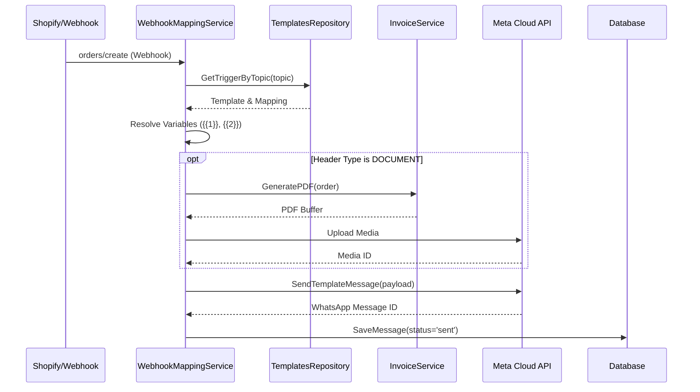

# Workflow: WhatsApp Automation

This document details the lifecycle of an automated WhatsApp message, from initial trigger to delivery tracking.

## 🔄 Logic Flow

## 🧩 Key Components

### 1. Webhook Mapping (`WebhookMappingService`)
- **Trigger Detection**: Listens for specific topics (e.g., `orders/fulfilled`).
- **Variable Resolution**: Maps template placeholders (e.g., `{{1}}`) to code-level fields:
    - `customer_name`: Fetched from order or default "Customer".
    - `order_total`: Dynamically calculated via `InvoiceService` to ensure tax accuracy.
    - `tracking_link`: Derived from shipping providers.

### 2. Deduplication Logic
The system prevents spamming customers by checking `HasSentTemplate` within specific time windows:
- **Status Updates**: 2-minute window.
- **Delivery Tracking**: 1-hour window.

### 3. Dynamic Attachments
If a template is configured with a "Dynamic Invoice" header:
1. The `InvoiceService` generates a GST-compliant PDF in memory.
2. The file is uploaded to Meta's servers.
3. The resulting Media ID is attached to the template message.

## 📈 Status Tracking
The `automation_messages` table tracks:
- `sent`: Dispatched from our backend.
- `delivered`: Reached the customer's device.
- `read`: Opened by the customer (if read receipts are on).
- `failed`: Check `error_message` column for Meta API errors.

---
> [!IMPORTANT]
> All automated messages require a pre-approved template in the Meta Business Suite.
